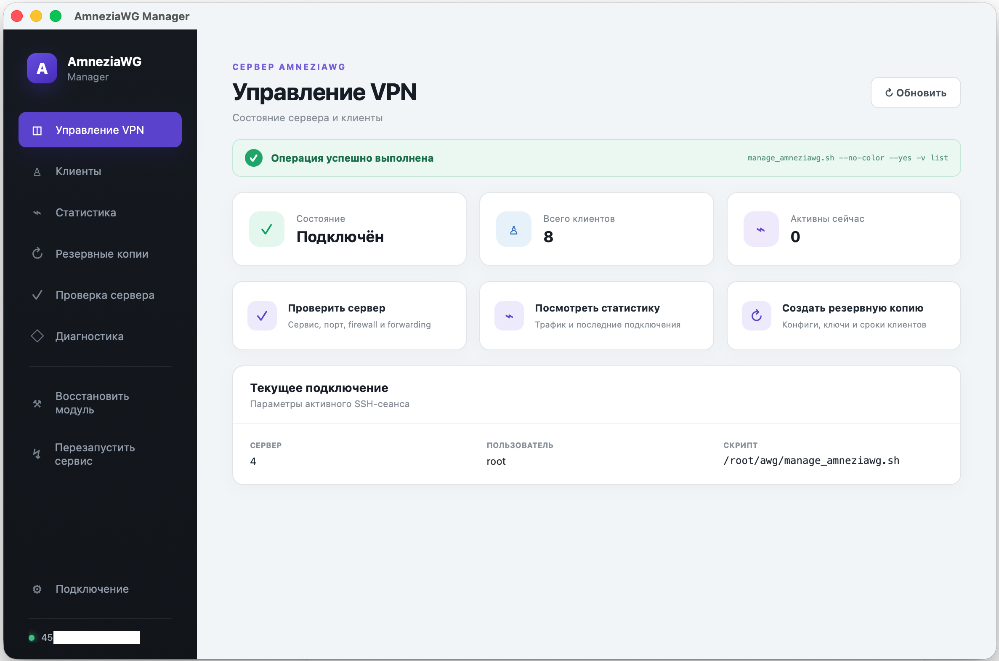

# AmneziaWG Manager

Нативный графический клиент для управления сервером
[amneziawg-installer](https://github.com/bivlked/amneziawg-installer) с macOS.

Приложение подключается к Ubuntu-серверу по SSH и вызывает штатный
`manage_amneziawg.sh`. Оно не переносит VPN-логику в GUI, не устанавливает на
сервер веб-панель, Docker, базу данных или дополнительный демон.

> [!IMPORTANT]
> Это независимый неофициальный проект. Он не связан с Amnezia VPN и автором
> `amneziawg-installer`.



## Возможности

- несколько сохраняемых профилей серверов;
- подключение по пути к SSH-ключу или ключу, вставленному в приложение;
- одно multiplexed SSH-соединение с keepalive и закрытием при выходе;
- список клиентов, адреса, активность и срок действия;
- добавление одного или нескольких клиентов;
- временные клиенты: `1h`, `12h`, `1d`, `7d`, `30d`, `4w`;
- опциональный PresharedKey;
- пакетное удаление и перегенерация выбранных клиентов;
- перегенерация `.conf`, QR и `vpn://` всех существующих клиентов;
- изменение `DNS`, `Endpoint`, `AllowedIPs`, `PersistentKeepalive`;
- таблица статистики трафика из `stats --json`;
- просмотр, копирование и сохранение `.conf`, QR и `vpn://`;
- создание, скачивание, восстановление и удаление бэкапов;
- проверка сервера, диагностика и вывод команд;
- перезапуск сервиса и восстановление модуля AmneziaWG.

## Архитектура

```text
AmneziaWG Manager на Mac
        │
        │ SSH по ключу
        ▼
Ubuntu-сервер
        │
        └── /root/awg/manage_amneziawg.sh <команда>
```

Изменяющие операции выполняются только через разрешённый список команд
`manage_amneziawg.sh`. Прямой SSH-доступ используется для чтения созданных
клиентских файлов и списка бэкапов. Аргументы проверяются в Rust до запуска SSH.

## Требования

### Сервер

- Ubuntu с установленным `amneziawg-installer`;
- доступ по SSH-ключу;
- по умолчанию скрипт ожидается в `/root/awg/manage_amneziawg.sh`;
- вход под `root` либо пользователь с passwordless `sudo` для нужных операций.

### Разработка на macOS

- macOS 10.15 или новее;
- Node.js и pnpm;
- Rust stable;
- Xcode Command Line Tools или Xcode;
- системный OpenSSH.

## Запуск из исходников

```bash
git clone https://github.com/rockysys/amneziawg-manager.git
cd amneziawg-manager
pnpm install
pnpm tauri dev
```

Сборка `.app`:

```bash
pnpm tauri build --bundles app
```

## Подключение

1. Укажите IP/hostname, SSH-порт и пользователя.
2. Укажите абсолютный путь к приватному ключу либо вставьте ключ целиком.
3. При необходимости измените путь к `manage_amneziawg.sh`.
4. Нажмите **Подключиться**.
5. Сохраните профиль, чтобы IP и путь к ключу подставлялись при следующем запуске.

Вставленный приватный ключ не сохраняется в профиле. Для запуска SSH он временно
записывается с правами `0600` и удаляется после команды. Первый host key
принимается по модели TOFU (`StrictHostKeyChecking=accept-new`), последующие
подключения проверяются через стандартный `known_hosts`.

## Проверки

```bash
pnpm build
cargo fmt --manifest-path src-tauri/Cargo.toml -- --check
cargo test --manifest-path src-tauri/Cargo.toml --lib
cargo check --manifest-path src-tauri/Cargo.toml
```

## Ограничения

- текущая реализация SSH-транспорта ориентирована на macOS;
- приложение ожидает совместимый `manage_amneziawg.sh` с JSON для `list` и `stats`;
- сборка пока не подписана Apple Developer ID и не notarized;
- Windows-версия потребует адаптации SSH-транспорта или перехода на `russh`.

## Безопасность

Не публикуйте приватные ключи, клиентские конфиги, QR-коды и серверные бэкапы.
Инструкции по ответственному сообщению об уязвимостях находятся в
[SECURITY.md](SECURITY.md).

## Лицензия

[MIT](LICENSE)

---

## English

AmneziaWG Manager is an unofficial native macOS GUI for managing servers
installed with `amneziawg-installer`. It connects over SSH and delegates VPN
operations to the server's existing `manage_amneziawg.sh`; no web panel, agent,
database, Docker container, or additional open port is required.
